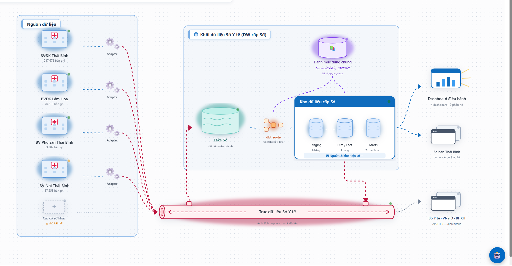
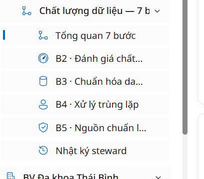
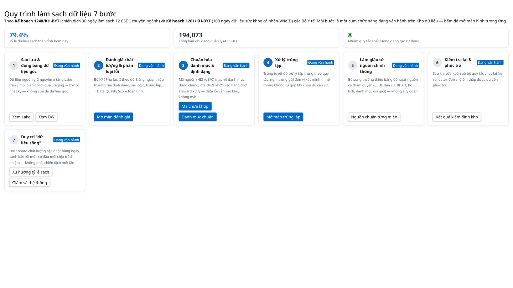
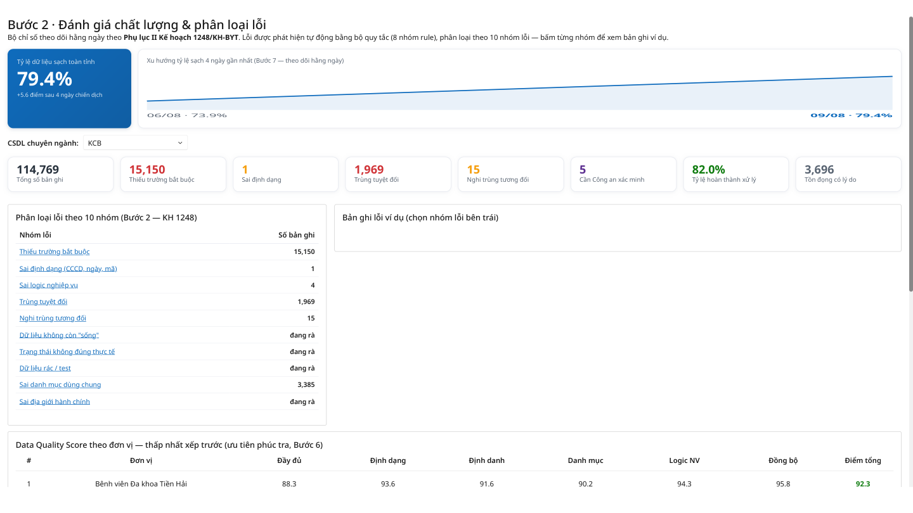
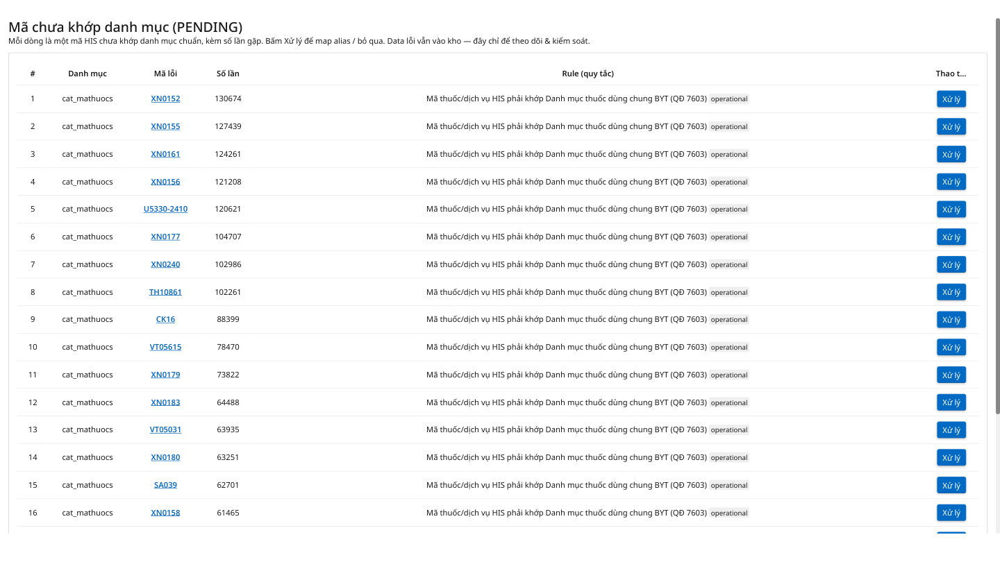
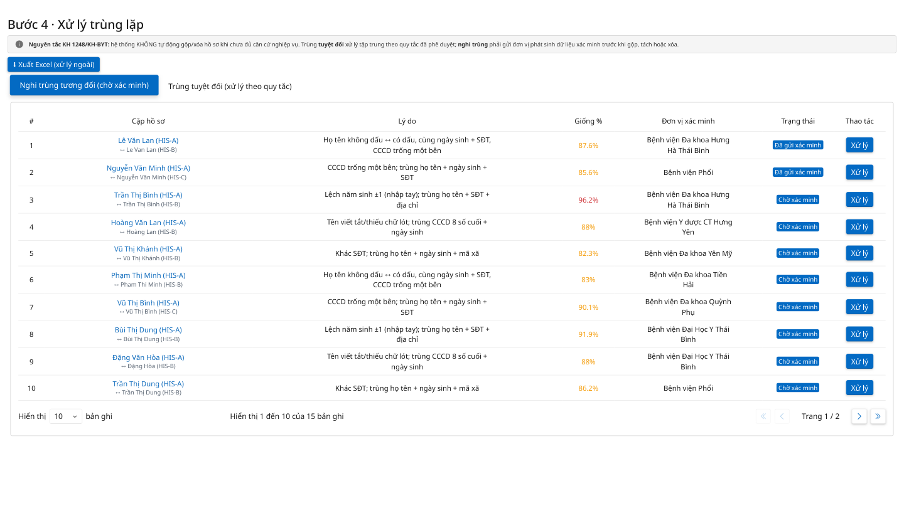
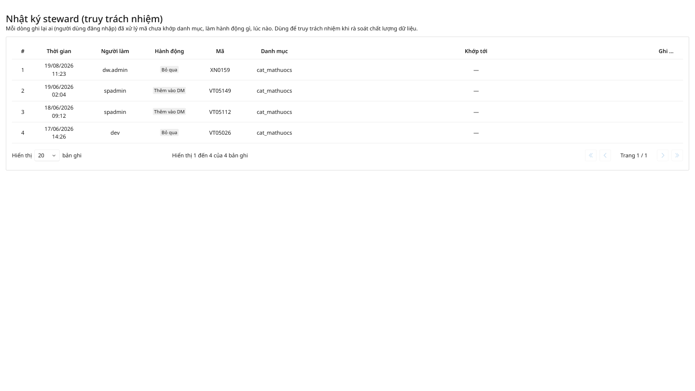
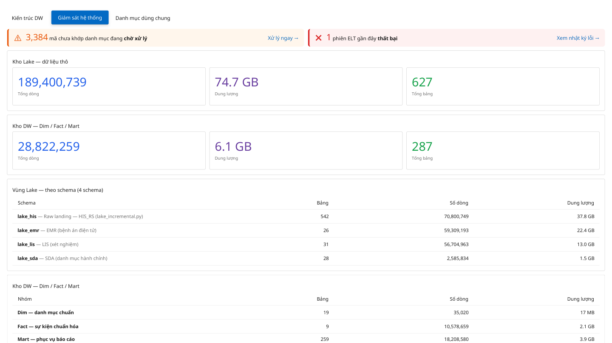

# Audit màn Giám sát và Chất lượng dữ liệu

## Phạm vi

- Màn topology Kho dữ liệu Sở Y tế do người dùng cung cấp.
- Navigation và workflow `Chất lượng dữ liệu — 7 bước`.
- Đối chiếu các capture desktop ngày 2026-08-19.
- Audit kết hợp UX và accessibility từ ảnh tĩnh; chưa xác nhận hành vi live do phiên Browser không khả dụng trong lần audit này.

## Mục tiêu người dùng

1. Người điều hành thấy toàn cảnh nguồn → Lake → dbt → DW → consumer và biết thành phần nào đang có vấn đề.
2. Data steward đi từ phát hiện lỗi tới chuẩn hóa, xử lý trùng, bổ sung danh mục, tái kiểm định và truy vết quyết định.

## Bằng chứng

### 1. Topology cấp Sở

Health: **ý tưởng mạnh, capture tương tác chưa đủ**.

Màn hình đang đóng vai trò bản đồ vận hành, không chỉ là sơ đồ kiến trúc. Nó biểu diễn:

- Nguồn theo cơ sở y tế, số bản ghi và trạng thái.
- Adapter kết nối từng nguồn.
- Lake Sở, workflow `dbt_soyte`, Staging, Dim/Fact, Marts.
- CommonCatalog, trục dữ liệu, dashboard, sandbox và hệ thống ngoài.
- Màu cạnh khác nhau cho các loại quan hệ, nhưng chưa có legend giải thích.

Điểm tốt là người dùng thấy được câu chuyện end-to-end trên một mặt phẳng. Rủi ro chính là chữ và trạng thái rất nhỏ; green/orange dot và edge red/blue/purple phụ thuộc màu, khó hiểu khi không có chú giải. Chưa có bằng chứng về selected state, hover, keyboard focus hoặc drawer chi tiết khi bấm node.

### 2. Navigation chất lượng dữ liệu

Health: **có cấu trúc nghiệp vụ, nhưng nhãn bị cắt và thiếu khả năng định vị**.

Sidebar ưu tiên các bước cần steward thao tác thường xuyên: tổng quan, B2, B3, B4, B5 và nhật ký. B1, B6, B7 không hiện trực tiếp; chúng được dẫn từ màn tổng quan. Cách này giảm menu nhưng làm người mới khó hiểu tại sao gọi là “7 bước” trong khi sidebar không có đủ 7 mục.

Các nhãn `B2 · Đánh giá chất...`, `B3 · Chuẩn hóa da...`, `B5 · Nguồn chuẩn l...` bị cắt. Cần tooltip, vùng sidebar rộng hơn hoặc label hai dòng. Trạng thái active chỉ có vạch xanh mảnh nên cần thêm nền/weight rõ ràng và `aria-current`.

### 3. Tổng quan 7 bước

Health: **tốt về mô hình workflow, cần làm rõ trạng thái và CTA**.

Màn hình mô tả đúng một chu trình vận hành:

1. Sao lưu và đóng băng dữ liệu gốc.
2. Đánh giá chất lượng và phân loại lỗi.
3. Chuẩn hóa danh mục và định dạng.
4. Xử lý trùng lặp.
5. Làm giàu từ nguồn chính thống.
6. Kiểm tra lại và phúc tra.
7. Duy trì dữ liệu sạch.

Ba KPI trên đầu giúp định hướng nhanh. Tuy nhiên tất cả card cùng ghi `Đang vận hành`, không cho biết step nào đang tốt, cảnh báo, chờ steward hoặc lỗi. CTA cũng chưa nhất quán: có card một nút, card hai nút, và một số nút giống secondary action dù là hành động chính.

### 4. B2 — Đánh giá chất lượng

Health: **base screen tốt, thiếu capture drill-down**.

Màn hình kết hợp score, trend, bộ chọn CSDL, nhóm lỗi và bảng xếp hạng đơn vị. Đây là dashboard điều tra chứ không chỉ báo cáo. Khu vực “Bản ghi lỗi ví dụ” trống cho đến khi chọn nhóm lỗi bên trái, nhưng capture chưa có trạng thái sau khi chọn nên chưa biết density, action và khả năng truy ngược bản ghi.

### 5. B3/B5 — Mã chưa khớp và danh mục chuẩn

Health: **đã thấy backlog, chưa thấy quyết định steward**.

Danh sách thể hiện mã lỗi, tần suất, rule và action `Xử lý`. Nghiệp vụ ngầm phía sau action phải có ít nhất các lựa chọn: map alias, thêm danh mục hợp lệ, bỏ qua có lý do và chuyển cấp. Capture hiện không có dialog, validation, confirmation hay kết quả sau xử lý.

### 6. B4 — Xử lý trùng lặp

Health: **đã có candidate queue, thiếu flow xử lý rủi ro cao**.

Điểm mạnh là tách “nghi trùng tương đối” khỏi “trùng tuyệt đối” và nêu nguyên tắc không tự gộp khi chưa xác minh. Nhưng action `Xử lý` là phần quan trọng nhất vẫn chưa được capture: so sánh trường, chọn bản ghi chuẩn, giữ/tách/gộp, conflict, xác nhận, rollback và audit event.

### 7. Nhật ký steward

Health: **đúng vai trò truy vết, nhưng thông tin còn mỏng**.

Đã có ai, lúc nào, hành động, mã và danh mục. Nên bổ sung object link, before/after, lý do, nguồn yêu cầu, correlation/run id và filter theo steward/action/date. Cột cuối đang bị cắt ở tiêu đề.

### 8. B7/Giám sát hệ thống

Health: **đủ KPI vận hành nền, chưa nối chặt với topology**.

Có cảnh báo pending catalog, ELT failure, kích thước Lake/DW và inventory schema. Cần cho phép bấm cảnh báo để đi đúng backlog/run lỗi, đồng thời đồng bộ trạng thái này về node/edge trên topology.

## Mô hình nghiệp vụ rút ra

### Monitoring capability

- `DataSourceFacility`
- `AdapterConnection`
- `DataLakeZone`
- `TransformationWorkflow`
- `WarehouseLayer`
- `DataProduct` / `Consumer`
- `TopologyNode`, `TopologyEdge`, `HealthMetric`
- `PipelineRun`, `PipelineIncident`

### Data Quality capability

- `QualityCampaign`, `QualityRun`
- `QualityRuleGroup`, `QualityRule`, `RuleResult`
- `DataIssue`, `IssueOccurrence`
- `StandardCatalog`, `CatalogEntry`, `CatalogBinding`
- `DuplicateCandidate`, `StewardDecision`
- `ValidationRun`, `AuditEvent`

Jmix nên quản lý metadata, quyền, workflow và audit của các object này. Airflow/dbt vẫn thực thi data plane; backend chỉ trigger, đồng bộ trạng thái và lưu quyết định điều hành.

## Đề xuất UI cho Refine + shadcn

- Topology: `@xyflow/react` với custom node, custom edge, `Controls`, `MiniMap`, `fitView`, node click mở shadcn `Sheet`.
- Quality overview: shadcn cards nhưng biểu diễn status thật (`healthy`, `warning`, `blocked`, `pending-review`), không dùng chung một badge.
- Queue screens: TanStack Table, filter state đồng bộ URL, bulk selection có giới hạn quyền.
- Steward actions: shadcn `Dialog` hoặc `Sheet`, bắt buộc reason, preview tác động và confirm.
- Mọi trạng thái màu phải có icon + text; topology cần legend và chế độ list thay thế cho accessibility.

## Coverage capture hiện tại

Kho hiện có 65 screen-set/157 PNG ở thư mục tổng và 46 screen-set/116 PNG ở bộ desktop ngang. Riêng quality có 12 screen-set; monitoring có 9–13 screen-set tùy bộ.

| Surface | Coverage |
|---|---|
| Kiến trúc DW cấp bệnh viện | Có |
| Topology cấp Sở đúng như ảnh người dùng vừa gửi | Trước đó chưa có; ảnh này mới là bằng chứng đầu tiên |
| Giám sát hệ thống/KPI | Có base screen |
| Tổng quan 7 bước | Có |
| B2 đánh giá | Có base screen; thiếu drill-down nhóm lỗi |
| B3 chuẩn hóa/danh mục | Có các list liên quan; thiếu dialog xử lý |
| B4 trùng lặp | Có queue; thiếu dialog và confirmation |
| B5 nguồn chuẩn | Có danh mục đích; thiếu add/edit/detail |
| B6 tái kiểm định | Có rule/validation liên quan; chưa có flow hoàn chỉnh |
| B7 duy trì/monitor | Có base screen; thiếu drill-down incident/run |
| Steward log | Có base screen |
| Add/edit binding | Chưa có dialog |
| Empty/loading/error/permission states | Chưa được capture có chủ đích |
| Keyboard/focus/responsive reflow | Chưa kiểm chứng |

## Capture cần bổ sung

1. Topology: node hover, node click, edge click, zoom/fit, add source, warning node, consumer drill-down.
2. B2: chọn từng nhóm lỗi và mở bản ghi lỗi cụ thể.
3. B3/B5: toàn bộ dialog xử lý mã chưa khớp, thêm/sửa binding và danh mục.
4. B4: compare/merge/keep-separate/confirm/success/error.
5. B6/B7: chạy lại kiểm định, kết quả run và incident detail.
6. Role variants: admin, steward, analyst/read-only.
7. Loading, empty, validation error, API error và long-content states.

## Giới hạn bằng chứng

- Browser live không khả dụng trong lần audit này, vì vậy chưa xác nhận hành vi thật sau click.
- Các finding accessibility về keyboard, focus, screen reader và zoom chỉ là rủi ro nhìn thấy từ ảnh; chưa phải kiểm định WCAG đầy đủ.
